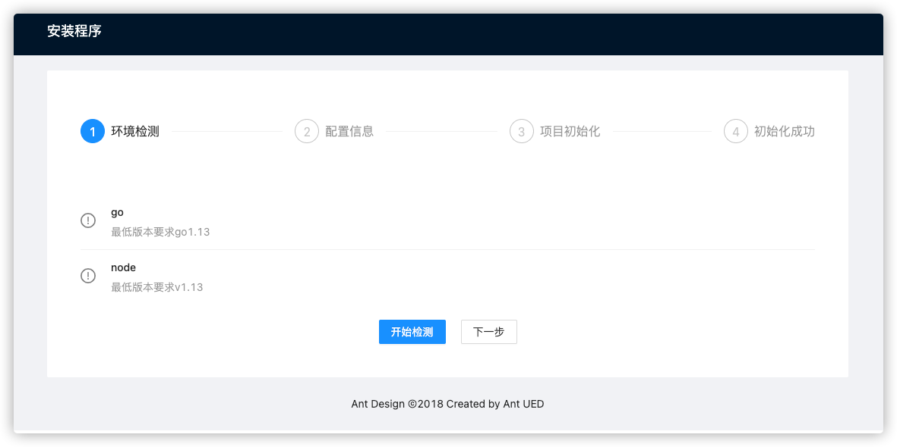
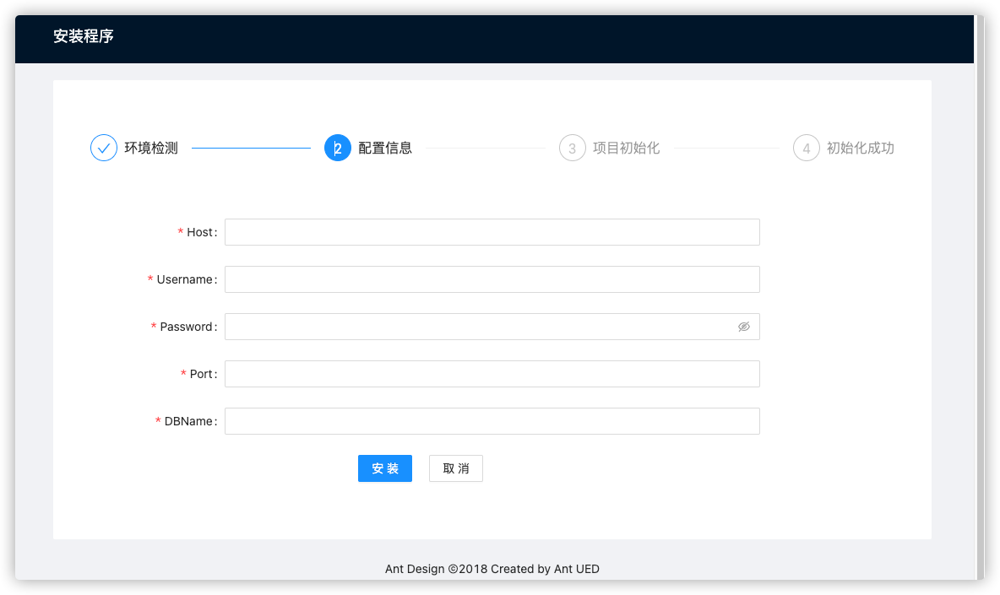
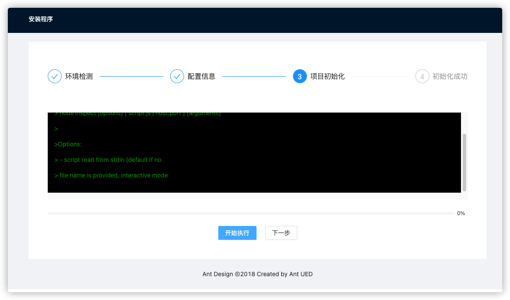

# web-installer-backend

web 项目图形化界面安装器，可以当作项目的外挂程序


有些项目在部署的时候，可能是并不是开发人员，可以把一些环境检测， 数据库初始化，makefile执行等命令做成一个可视化界面便于直观操作

## Features

- 环境检测
- 数据库配置
- 脚本执行


## Deployment

前端项目打包，我这里使用的是vue3 做的一个简易界面
[web-installer](https://github.com/laoningmeng/web-installer)


```bash
  cd web-installer
  npm run build
```
得到`dist` 文件夹，整个文件夹复制到本项目的根目录

```bash
├── app
├── boot
├── dist # 复制到这
├── global
├── go.mod
├── go.sum
├── main.go
├── middleware
├── readme.md
└── router


```

项目打包：
```bash
go build 
```
打包得到的是一个内嵌静态文件的可执行文件，不需要单独部署前端文件， 可以将编译好的二进制文件放到项目，作为一个小工具






